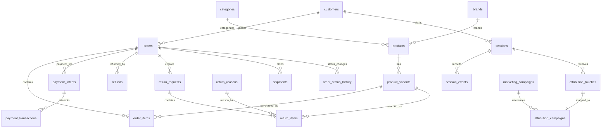
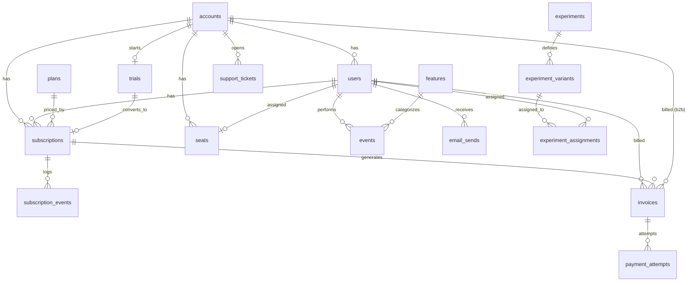

# B2C vs SaaS Product Analytics Case Study

A comparative product analytics case study exploring how customer journeys, retention, and growth differ across a B2C e-commerce business and a SaaS subscription business using SQL.

---

## Project Overview

Although product analytics relies on familiar concepts such as funnels, cohorts, retention, and conversion, these metrics often represent very different business questions depending on the product.

This project analyzes two PostgreSQL datasets—a B2C e-commerce business and a SaaS subscription business—to understand how the same analytical framework translates across different business models.

**The analysis covers:**

### B2C E-commerce

- Customer Activation
- Checkout Funnel Analysis
- Weekly Cohort Retention
- High-View Low-Cart Product Analysis
- Cart Abandonment Analysis

### SaaS

- Monthly Recurring Revenue (MRR)
- Trial-to-Paid Conversion
- Gross & Net Revenue Retention (GRR / NRR)
- Payment Recovery (Dunning Funnel)
- Expansion Revenue Analysis

---

## Skills Demonstrated

### SQL

- PostgreSQL
- Complex Joins
- Common Table Expressions (CTEs)
- Window Functions
- Cohort Analysis
- Funnel Analysis
- Conditional Aggregation
- Revenue Reconciliation
- Time-Series Analysis

### Product Analytics

- Customer Lifecycle Analysis
- Subscription Analytics
- Retention Analysis
- Product Funnel Optimization
- Business KPI Design
- Data Validation
- Insight Generation
- Comparative Product Analysis

---

# Database Schemas

## E-commerce



## SaaS



---

# Analysis Summary

## B2C E-commerce

| Analysis                     | Business Question                                                 | SQL Concepts                             |
| :--------------------------- | :---------------------------------------------------------------- | :--------------------------------------- |
| Customer Activation          | How quickly do new customers reach their first meaningful action? | Window functions, event sequencing       |
| Checkout Funnel              | Where do customers abandon the purchase journey?                  | Funnel analysis, conditional aggregation |
| Weekly Retention             | How effectively are customers retained after signup?              | Cohort analysis                          |
| Product Opportunity Analysis | Which products receive interest but fail to convert?              | Ranking, joins                           |
| Cart Abandonment             | Which cart segments contribute most to lost revenue?              | Aggregation, segmentation                |

---

## SaaS

| Analysis                  | Business Question                                          | SQL Concepts                           |
| :------------------------ | :--------------------------------------------------------- | :------------------------------------- |
| Monthly Recurring Revenue | How is recurring revenue changing over time?               | Running totals, revenue reconciliation |
| Trial Conversion          | How effectively do trials convert into paid subscriptions? | Cohort analysis                        |
| Revenue Retention         | How much recurring revenue is retained and expanded?       | GRR, NRR calculations                  |
| Payment Recovery          | Which failed payments are successfully recovered?          | Funnel analysis                        |
| Expansion Revenue         | What drives growth from existing customers?                | Revenue categorization                 |

---

# Comparative Case Study

The complete write-up comparing both business models is available in **[CASE_STUDY.md](https://able-bat-6e9.notion.site/B2C-vs-B2B-How-Funnels-and-Retention-Actually-Differ-3ae85cc041fb80398e56f2aa4a3a5764?source=copy_link)**.

The case study explores:

- Funnel design across B2C and SaaS
- Behavioral vs. revenue retention
- Activation vs. trial conversion
- Shared analytical patterns
- Reflections on product analytics across domains

---

# Key Insights

Some of the major observations from this project include:

- Similar analytical techniques can answer fundamentally different business questions depending on the product.
- Customer retention and revenue retention are distinct metrics that require different definitions and interpretations.
- SaaS growth extends beyond customer acquisition through expansion revenue, while e-commerce relies more heavily on repeat purchasing.
- Defining business metrics correctly is often more important than writing complex SQL.

---

# How to Run

- Connect to the Metabase database.
- Open the appropriate SQL script from the `queries/` directory.
- Execute the query.
- Each query includes:
  - Business objective
  - Assumptions
  - SQL implementation
  - Validation checks

---

# Assumptions

### E-commerce

- Activation excludes events occurring before recorded signup timestamps.
- Incomplete customer journeys are excluded where appropriate.
- Funnel analyses operate at the session level.
- Recent cohorts may be right-censored.

### SaaS

- MRR is derived from subscription events.
- Trial subscriptions (MRR = 0) are excluded from recurring revenue calculations.
- Revenue metrics follow the project reporting cutoff.
- Subscription analyses are performed at the account/subscription level.

---

## Reflection

### What I Learned

This project reinforced that strong product analytics begins with defining business metrics rather than writing SQL. Although the underlying SQL techniques remained largely consistent across both datasets, the meaning of concepts such as funnels, retention, and conversion changed considerably depending on the business model. Understanding those differences proved just as important as producing technically correct queries.

### What I'd Do Next

I'd extend this project by building interactive dashboards, segmenting analyses by customer acquisition channels and account types, and incorporating experimentation data to evaluate how product changes influence conversion, retention, and long-term customer value.

---

# Repository Structure

```
.
├── queries/
│   ├── e1_customer_activation.sql
│   ├── e2_checkout_funnel.sql
│   ├── e3_weekly_cohort_retention.sql
│   ├── e4_high_view_low_cart_products.sql
│   ├── e5_cart_abandonment_analysis.sql
│   ├── s1_monthly_mrr_movement.sql
│   ├── s2_trial_to_paid_conversion.sql
│   ├── s3_gross_net_revenue_retention.sql
│   ├── s4_payment_recovery_dunning_funnel.sql
│   └── s5_expansion_revenue_analysis.sql
│
├── notes/
│   └── saas_schema.md
│
├── CASE_STUDY.md
├── README.md
└── LICENSE
```

---

# Author

**Adyasha Mahanta**
