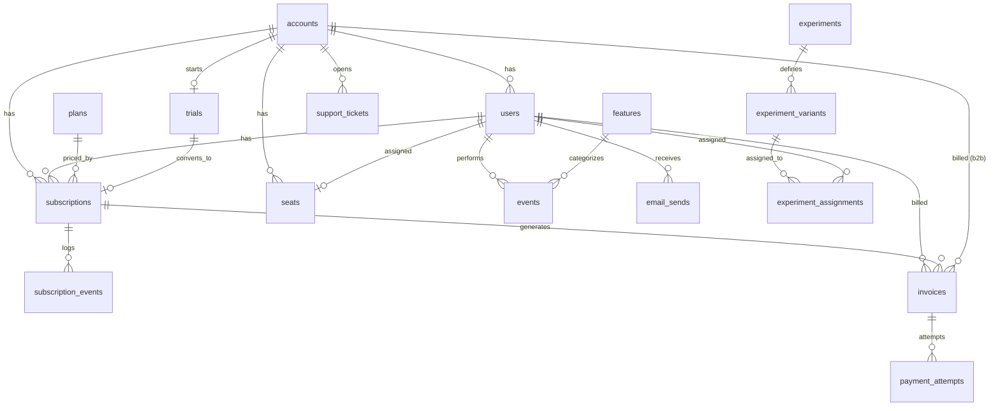

## A. Table Inventory

| **table**              | **approx_rows** | **what it stores**                                              | **grain**                                   |
| ---------------------- | --------------- | --------------------------------------------------------------- | ------------------------------------------- |
| events                 | 53,534          | product telemetry — which user used what feature, when          | 1 row = 1 user event                        |
| payment_attempts       | 5,690           | every charge attempt (succeeded or failed), with retry tracking | 1 row = 1 charge attempt                    |
| invoices               | 4,201           | billed amounts and payment status per period                    | 1 row = 1 invoice                           |
| subscription_events    | 3,741           | event log of plan changes and seat movements                    | 1 row = 1 subscription-level event          |
| email_sends            | 3,385           | lifecycle / re-engagement / dunning email log                   | 1 row = 1 email sent                        |
| experiment_assignments | 3,200           | treatment/control assignment per user per experiment            | 1 row = 1 user's assignment to 1 experiment |
| users                  | 2,556           | humans inside an account                                        | 1 row = 1 user                              |
| subscriptions          | 2,113           | plan attached to a user (self-serve) or account (b2b)           | 1 row = 1 subscription period               |
| seats                  | 1,556           | seat assignments within an account                              | 1 row = 1 seat assignment                   |
| accounts               | 1,250           | the paying entity — self_serve or b2b                           | 1 row = 1 account                           |
| support_tickets        | 1,249           | account-grain support load                                      | 1 row = 1 support ticket                    |
| trials                 | 250             | trial start/end, converted vs lapsed                            | 1 row = 1 trial                             |
| features               | 50              | catalog of product features                                     | 1 row = 1 feature                           |
| experiment_variants    | 8               | variant definitions for each experiment                         | 1 row = 1 variant of 1 experiment           |
| plans                  | 8               | pricing tiers (free/starter/pro/enterprise, monthly + annual)   | 1 row = 1 plan                              |
| experiments            | 4               | product experiments list + status                               | 1 row = 1 experiment                        |
| legacy_events          | 15,028          | pre-migration event log                                         | _ignore, per brief_                         |
| legacy_invoices        | 1,500           | pre-migration invoices                                          | _ignore, per brief_                         |
| legacy_subscriptions   | 500             | pre-migration subscriptions                                     | _ignore, per brief_                         |
| legacy_support_tickets | 300             | pre-migration support tickets                                   | _ignore, per brief_                         |
| legacy_companies       | 200             | pre-migration company/account records                           | _ignore, per brief_                         |

| **views** | **approx_rows** | **what it stores**                                                | **grain**        |
| --------- | --------------- | ----------------------------------------------------------------- | ---------------- |
| signups   | 2,556           | `(user_id, account_id, signup_date, signup_source)` for cohorting | 1 row = 1 signup |

> **Note on FKs:** `information_schema.table_constraints` returned zero rows for `schema='saas'` — there are **no declared foreign key constraints** in this schema.

---

## B. Per-Column Notes

#### accounts

- `account_id` — PK, bigint, NOT NULL — joins to: users.account_id, subscriptions.account_id, seats.account_id, trials.account_id, events.account_id, invoices.account_id, payment_attempts.account_id, support_tickets.account_id, subscription_events.account_id, signups.account_id
- `name` — text, NOT NULL
- `account_type` — text, NOT NULL, categorical
  Account Type Count
  b2b 250
  self_serve 1,000
- `industry` — text, nullable
- `employee_count` — integer, nullable
- `country` — text, nullable
- `signup_date` — timestamp with time zone, nullable, (January 3, 2022, 12:00 AM - June 1, 2026, 12:00 AM)
- `acquisition_channel` — text, nullable, categorical
  Acquisition Channel Count
  direct 144
  g2 61
  google*ads 158
  linkedin 158
  organic 191
  outbound 49
  product_hunt 134
  referral 207
  *(blank)\_ 148

#### users

- `user_id` — PK, integer, NOT NULL — joins to: subscriptions.user_id, seats.user_id, events.user_id, email_sends.user_id, experiment_assignments.user_id, invoices.user_id, payment_attempts.user_id, subscription_events.user_id, subscription_events.actor_user_id, support_tickets.opened_by_user_id, signups.user_id
- `email` — text, nullable
- `company_name` — text, nullable
- `signup_date` — timestamp without time zone, nullable, (January 3, 2022, 12:00 AM - June 28, 2026, 12:00 AM)
- `signup_source` — text, nullable, categorical
  Signup Source Count
  direct 144
  google*ads 158
  linkedin 119
  organic 140
  product_hunt 134
  referral 157
  signup 250
  team_invite 1,306
  *(blank)\_ 148
- `plan_type` — text, nullable, categorical
  Plan Type Count
  enterprise 148
  Enterprise 169
  free 200
  pro 209
  Pro 89
  professional 49
  starter 136
  _(blank)_ 1,556
- `is_active` — integer, nullable
- `last_login_date` — timestamp without time zone, nullable, (June 30, 2022, 12:00 AM -June 15, 2026, 12:00 AM )
- `account_id` — FK to accounts.account_id, nullable
- `role` — text, nullable, categorical
  Role Count
  admin 430
  member 876
  owner 1,250

#### subscriptions

- `subscription_id` — PK, integer, NOT NULL — joins to: subscription_events.subscription_id, invoices.subscription_id, payment_attempts.subscription_id,
- `user_id` — integer, nullable, FK to users.user_id
- `plan` — text, nullable, categorical
  Plan Count
  enterprise 287
  Enterprise 285
  free 270
  pro 348
  Pro 282
  professional 294
  starter 347
- `start_date` — timestamp without time zone, nullable, (March 23, 2022, 12:00 AM - June 2, 2026, 12:00 AM)
- `end_date` — timestamp without time zone, nullable, (July 20, 2022, 12:00 AM - May 6, 2028, 12:00 AM)
- `mrr` — numeric, nullable
- `status` — text, nullable, categorical
  Status Count
  active 885
  churned 557
  past_due 195
  paused 184
  trialing 292
- `cancelled_at` — timestamp without time zone, nullable, (November 2, 2022, 12:00 AM - May 8, 2027, 12:00 AM)
- `cancellation_reason` — text, nullable, categorical
  Cancellation Reason Count
  budget*cuts 73
  missing_features 99
  no_longer_needed 67
  poor_support 82
  switched_competitor 71
  too_expensive 77
  *(blank)\_ 1,644
- `account_id` — bigint, nullable, FK to accounts.account_id
- `seat_count` — integer, nullable
- `plan_id` — integer, nullable, FK to plans.plan_id

#### subscription_events

- `event_id` — PK, integer, NOT NULL
- `subscription_id` — integer, nullable, FK to subscriptions.subscription_id
- `user_id` — integer, nullable, FK to users.user_id
- `event_type` — text, nullable, categorical
  Event Type Count
  addon_attach 14
  cancelled 557
  plan_changed 336
  seat_add 129
  subscription_started 2,000
  trial_converted 113
  trial_started 592
- `event_time` — timestamp without time zone, nullable, (March 23, 2022, 12:00 AM - May 8, 2027, 12:00 AM)
- `from_plan` — text, nullable
- `to_plan` — text, nullable
- `mrr_delta` — numeric, nullable
- `account_id` — bigint, nullable, FK to accounts.account_id
- `actor_user_id` — integer, nullable, FK to users.user_id
- `seats_delta` — integer, nullable

#### plans

- `plan_id` — PK, integer, NOT NULL — joins to: subscriptions.plan_id
- `plan_name` — text, NOT NULL
- `monthly_price` — numeric, NOT NULL, USD
- `seat_limit` — integer, nullable
- `billing_interval` — text, NOT NULL

#### features + events

- `features.feature_id` — PK, integer, NOT NULL — joins to: events.feature_id
- `features.feature_name` — text, nullable
- `features.category` — text, nullable
- `features.release_date` — timestamp without time zone, nullable, (March 14, 2022, 12:00 AM - December 25, 2025, 12:00 AM)
- `events.event_id` — PK, integer, NOT NULL
- `events.user_id` — integer, nullable, FK to users.user_id
- `events.event_type` — text, nullable
  Event Type Count
  api_call 5,428
  dashboard_view 9,187
  export 3,740
  feature_use 10,891
  invite_sent 2,344
  login 17,898
  report_view 1,293
  settings_change 2,753
- `events.occurred_at` — timestamp without time zone, nullable, (January 1, 2024, 12:23 AM - March 28, 2027, 1:05 PM)
- `events.properties` — text, nullable
- `events.account_id` — bigint, nullable, FK to accounts.account_id
- `events.feature_id` — integer, nullable, FK to features.feature_id

#### payment_attempts

- `attempt_id` — PK, integer, NOT NULL
- `invoice_id` — integer, nullable, FK to invoices.invoice_id
- `user_id` — integer, nullable, FK to users.user_id
- `subscription_id` — integer, nullable, FK to subscriptions.subscription_id
- `amount` — numeric, nullable
- `status` — text, nullable
  Status Count
  failed 2,293
  succeeded 3,397
- `failure_reason` — text, nullable
  Failure Reason Count
  authentication*required 418
  card_declined 544
  expired_card 447
  fraud_blocked 399
  insufficient_funds 485
  *(blank)\_ 3,397
- `attempt_number` — integer, nullable
- `attempted_at` — timestamp without time zone, nullable, (January 2, 2024, 4:00 AM - June 15, 2026, 12:00 AM)
- `account_id` — bigint, nullable, FK to accounts.account_id

#### trials

- `trial_id` — PK, bigint, NOT NULL
- `account_id` — bigint, nullable, FK to accounts.account_id
- `started_at` — timestamp with time zone, nullable, (July 16, 2024, 12:00 AM May 6, - 2026, 12:00 AM)
- `ends_at` — timestamp with time zone, nullable, (July 30, 2024, 12:00 AM - May 20, 2026, 12:00 AM)
- `converted_at` — timestamp with time zone, nullable, (July 29, 2024, 12:00 AM - May 19, 2026, 12:00 AM)
- `converted_subscription_id` — bigint, nullable

#### seats

- `seat_id` — PK, bigint, NOT NULL
- `account_id` — bigint, nullable, FK to accounts.account_id
- `user_id` — integer, nullable, FK to users.user_id
- `activated_at` — timestamp with time zone, nullable, (July 24, 2024, 12:00 AM - July 26, 2026, 12:00 AM)
- `deactivated_at` — timestamp with time zone, nullable, (February 28, 2025, 12:00 AM - May 31, 2026, 12:00 AM)

#### invoices

- `invoice_id` — PK, integer, NOT NULL — joins to: payment_attempts.invoice_id
- `user_id` — integer, nullable, FK to users.user_id
- `subscription_id` — integer, nullable, FK to subscriptions.subscription_id
- `amount` — numeric, nullable
- `status` — text, nullable, categorical
  Status Count
  overdue 511
  paid 3,082
  refunded 310
  void 298
- `issued_date` — timestamp without time zone, nullable, (January 1, 2024, 12:00 AM - June 14, 2026, 12:00 AM)
- `paid_date` — timestamp without time zone, nullable, (January 3, 2024, 12:00 AM - June 27, 2026, 12:00 AM)
- `due_date` — timestamp without time zone, nullable, (January 31, 2024, 12:00 AM - July 1, 2026, 12:00 AM)
- `account_id` — bigint, nullable, FK to accounts.account_id

#### support_tickets

- `ticket_id` — PK, bigint, NOT NULL
- `account_id` — bigint, nullable, FK to accounts.account_id
- `opened_by_user_id` — integer, nullable, FK to users.user_id
- `opened_at` — timestamp with time zone, nullable, (June 14, 2026, 4:17 AM - August 15, 2024, 8:32 AM)
- `closed_at` — timestamp with time zone, nullable, (June 19, 2026, 3:25 AM - August 17, 2024, 5:56 PM)
- `priority` — text, nullable
  Priority Count
  critical 142
  high 305
  low 325
  medium 477
- `category` — text, nullable
  Category Count
  billing 236
  bug_report 238
  feature_request 247
  onboarding 271
  technical 257
- `csat` — integer, nullable

#### email_sends

- `send_id` — PK, bigint, NOT NULL
- `user_id` — integer, nullable, FK to users.user_id
- `campaign_name` — text, nullable
- `send_type` — text, nullable
  Send Type Count
  dunning 1,114
  lifecycle 1,074
  reengagement 1,197
- `sent_at` — timestamp with time zone, nullable, (June 14, 2026, 12:00 AM - May 11, 2025, 12:00 AM)
- `opened_at` — timestamp with time zone, nullable, (June 15, 2026, 9:30 PM - May 12, 2025, 3:10 AM)
- `clicked_at` — timestamp with time zone, nullable, (June 15, 2026, 11:15 AM - May 13, 2025, 6:13 AM)

#### experiments / experiment_variants / experiment_assignments

- `experiments.experiment_id` — PK, integer, NOT NULL — joins to: experiment_variants.experiment_id, experiment_assignments.experiment_id
- `experiments.name` / `hypothesis` / `owner` / `status` — text
- `experiments.start_date` / `end_date` — timestamp without time zone, nullable
- `experiment_variants.variant_id` — PK, integer, NOT NULL — joins to: experiment_assignments.variant_id
- `experiment_variants.experiment_id` — FK to experiments.experiment_id
- `experiment_variants.allocation_pct` — numeric
- `experiment_variants.is_control` — boolean
- `experiment_assignments.assignment_id` — PK, integer, NOT NULL
- `experiment_assignments.user_id` — integer, nullable, FK to users.user_id
- `experiment_assignments.experiment_id` — integer, nullable, FK to experiments.experiment_id
- `experiment_assignments.variant` — text, nullable
- `experiment_assignments.variant_id` — integer, nullable, FK to experiment_variants.variant_id
- `experiment_assignments.assigned_at` — timestamp without time zone, nullable

#### signups _(view, not a base table)_

- `user_id` — joins to users.user_id
- `account_id` — joins to accounts.account_id
- `signup_date` — timestamp without time zone, (June 28, 2026, 12:00 AM - January 3, 2022, 12:00 AM)
- `signup_source` — text
  Signup Source Count
  direct 144
  google*ads 158
  linkedin 119
  organic 140
  product_hunt 134
  referral 157
  signup 250
  team_invite 1,306
  *(blank)\_ 148

---

## C. Verified Relationships

| parent              | child                  | join column               | cardinality | orphan_rows | remark         |
| ------------------- | ---------------------- | ------------------------- | ----------- | ----------- | -------------- |
| accounts            | users                  | account_id                | 1 to many   | 0           |                |
| accounts            | subscriptions          | account_id                | 1 to many   | 0           |                |
| users               | subscriptions          | user_id                   | 1 to many   | 0           |                |
| plans               | subscriptions          | plan_id                   | 1 to many   | 0           | null fk = 243  |
| subscriptions       | subscription_events    | subscription_id           | 1 to many   | 0           |                |
| accounts            | seats                  | account_id                | 1 to many   | 0           |                |
| users               | seats                  | user_id                   | 1 to 1      | 0           |                |
| accounts            | trials                 | account_id                | 1 to 1      | 0           |                |
| users               | events                 | user_id                   | 1 to many   | 40          | null fk = 526  |
| features            | events                 | feature_id                | 1 to many   | 0           | null fk =44163 |
| users               | invoices               | user_id                   | 1 to many   | 0           | null fk = 1201 |
| subscriptions       | invoices               | subscription_id           | 1 to many   | 0           |                |
| invoices            | payment_attempts       | invoice_id                | 1 to many   | 0           |                |
| accounts            | support_tickets        | account_id                | 1 to many   | 0           |                |
| users               | experiment_assignments | user_id                   | 1 to many   | 0           |                |
| experiments         | experiment_variants    | experiment_id             | 1 to many   | 0           |                |
| experiment_variants | experiment_assignments | variant_id                | 1 to many   | 0           |                |
| trials              | subscriptions          | converted_subscription_id | 1 to 1      | 0           | null fk = 137  |

---

## D. ER Diagram



---

## E. Six Probe Questions — ANSWERED

**1. Grain of `subscriptions`?** **Not 1 row per account — 1 row per subscription _period_.** `account_id` is populated on every row regardless of type (0 orphans); `user_id` is additionally populated on self-serve rows (since a self-serve account has exactly one user) and NULL on b2b rows. Seat counts confirm the split: b2b min/max seats 1–18 (113 subs), self-serve always exactly 1 seat (2,000 subs).

**Important nuance:** if an account churns and later resubscribes, that creates a **new row**, not an update to the existing one — so `subscriptions` is closer to an append-only history of subscription periods than a current-state table. This explains why total subscription rows (2,113) exceed total accounts (1,250): some accounts have more than one row across time. Any query counting "current subscriptions" needs to pick the latest row per account/user, not just count all rows.

**2. How is MRR stored?** `subscriptions.mrr` is a **separately-maintained current-state field**, not a live derivation of the event log — summing `subscription_events.mrr_delta` per subscription does **not** reconcile to `subscriptions.mrr` (confirmed mismatch; needs a follow-up pass excluding the 234 future-dated `subscription_events` rows to see if that closes the gap).

It also behaves **differently by `accounts.account_type`** (confirmed via direct reconciliation against `plans.monthly_price × seat_count`, joined through `accounts` to get the true type):

- **b2b (113 subs):** 88/113 (78%) reconcile exactly. The 25 that don't are **100% `status = 'churned'`** — `mrr` correctly drops to 0 on churn while `seat_count`/`plan_id` are left stale, so `expected_mrr` still uses the old seat count. Formula holds for every currently-billing b2b subscription.
- **self_serve (2,000 subs, 1,757 with non-null `plan_id`):** free-plan rows (231) reconcile perfectly (`mrr = 0`). But among **active, paying** rows, **0 of 597 reconcile** — not one. `mrr` cannot be derived from `plan`/`monthly_price` for self-serve at all; ratio of actual `mrr` to `monthly_price` ranges continuously from 0 to 1.8x even excluding churned rows.

**Conclusion:** treat `subscriptions.mrr` as the sole source of truth in both cases. For b2b it's independently _verifiable_ against plan × seats (except on churn). For self-serve it is not verifiable this way at all — `plan`/`plan_id` tell you the nominal tier, not the actual bill.

**3. Status values on `subscriptions`?** `active` 885, `churned` 557, `past_due` 195, `paused` 184, `trialing` 292 (total 2,113).

**4. Trial vs. paid signal?** Use `trials.converted_subscription_id` (non-NULL = converted; confirmed 1:1 with `subscriptions`, 0 orphans). **Confirmed matching counts:** 250 total trials, 113 have `converted_at` populated, and the same 113 have `converted_subscription_id` populated — both signals agree exactly, no discrepancy. This also matches `subscription_events.event_type = 'trial_converted'` (113 rows). Standardize on `trials.converted_subscription_id IS NOT NULL` as the trial→paid signal — simply having a row in `trials` at all indicates the account went through (or is going through) a trial.

**5. Timezone on timestamp columns?** Inconsistent by table: `accounts`, `trials`, `seats`, `support_tickets`, `email_sends` store `timestamptz`; `users`, `subscriptions`, `subscription_events`, `events`, `invoices`, `experiments` store `timestamp` (no tz).

**Range comparison:** `accounts.signup_date` (tz) spans Jan 3, 2022 – Jun 1, 2026; `users.signup_date` (no tz) spans Jan 3, 2022 – Jun 28, 2026. The **earliest date matches exactly to the day** across both columns, which is a good sign there's no fixed-hour offset between them — if `users.signup_date` were e.g. stored in IST while `accounts.signup_date` is UTC, you'd expect the earliest date to shift by a day for records near midnight. Treat the no-tz columns as effectively UTC unless a per-row join comparison (accounts vs. users for the same account, same-day signups) turns up a mismatch — that per-row check is still the more rigorous version of this and hasn't been run, but the aggregate range check is reassuring enough to proceed with "assume UTC" for now.

**6. Soft-delete pattern?** **No `deleted_at`-style column exists anywhere in the schema** — confirmed via `information_schema.columns` sweep for `%delet%`/`%archiv%`/`%active%`. The closest analog is **`users.is_active`** (integer flag) — this is a status flag, not a timestamped soft-delete, so there's no way to tell _when_ a user was deactivated, only _whether_ they currently are. Any query needing "currently active users" should filter on `is_active = 1` (confirm this is the correct truthy value); anything needing deactivation history has no source in this schema.

---

## F. Data Quality Findings

1. **Plan name case drift** — `users.plan_type` and `subscriptions.plan` both mix `pro`/`Pro`/`professional` and `enterprise`/`Enterprise`. Always `LOWER(plan)`; explicitly collapse `pro`/`professional` into one bucket.
2. **`events.user_id` orphans** — 40 true orphans (matches brief exactly) + 526 separate NULLs (not mentioned in brief).
3. **`subscriptions.cancellation_reason`** — blank for a large share of rows; cross-reference against `status='churned'` (557) to isolate true "no reason given" churns vs. non-churned rows that are blank by design. Bucket as `"no reason given"` where it applies — don't drop from churn analysis.
4. **`subscriptions.plan_id` NULLs** — 243/2,113 (11.5%) — brief estimated ~9%, actual is somewhat higher. `plan` text column still has the value for normalization.
5. **1,520 of 10,891 `feature_use` events have NULL `feature_id`** (14%) — not mentioned in brief. Genuine gap since `feature_use` should always carry a `feature_id` by definition.
6. **27 invoices have neither `user_id` nor `account_id`** — not mentioned in brief. Genuinely un-owned invoice rows.
7. **`subscriptions` is not account-current-state — it's append-only per subscription period.** An account that churns and later resubscribes gets a brand-new row, not an updated one. This is why `subscriptions` (2,113 rows) exceeds `accounts` (1,250 rows) — some accounts have 2+ historical subscription rows. Any "current subscription" query must select the latest row per account/user (e.g. `MAX(start_date)` or `ROW_NUMBER()` partitioned by account), not assume one row per account.

---

## G. Sample Queries Proving Understanding

### "How many active paying accounts are there right now?"

```sql
SELECT COUNT(DISTINCT COALESCE(s.account_id, u.account_id)) AS active_paying_accounts
FROM saas.subscriptions s
LEFT JOIN saas.users u ON s.user_id = u.user_id
WHERE s.status = 'active'
  AND LOWER(s.plan) != 'free';
```

### "What's the breakdown of accounts by plan?"

```sql
SELECT
  CASE
    WHEN LOWER(plan) IN ('pro', 'professional') THEN 'pro'
    ELSE LOWER(plan)
  END AS plan_normalized,
  COUNT(*) AS n
FROM saas.subscriptions
GROUP BY 1
ORDER BY 2 DESC;
```

### "Show 10 sample subscription_events in chronological order."

```sql
SELECT *
FROM saas.subscription_events
ORDER BY event_time
LIMIT 10;
```
